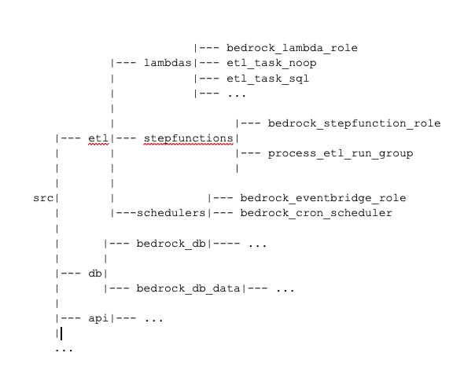

# Deploying a test copy
Included scripts will build a complete copy of Bedrock on AWS, including the asset database, roles, Lambdas, and the Step Function.

You will need AdministratorAccess command line permissions to AWS.

Create a file `make_variables` based on `make_variables.prod`. Change INSTANCE to a unique name for your instance, and set the region and account info.
The variable build_mode can be set to "std" if deploying from Linux or "sam" to use a container. This is needed for two Python Lambdas that need Linux native compilation targets for encryption used by the paramiko package.

Then cd into each directory and run ```make``` commands to create the infrastructure.

```bash
make init
make apply
```
- You can also use ```apply-y``` instead of ```apply``` without having to reply 'yes' to each step.
- When you are done you can run ```make destroy``` in each directory.

### Build everything
```sh
cd src/db
make init
make apply-y #(Creates database server)
make db      #(Creates bedrock database)
make seed    #(Fill database with assets from Github)
cd ../etl
make init
make apply-y
```

### Build one Lambda
```sh
# Make sure you create the role needed first
cd src/etl/bedrock-lambda-role
make init
make apply-y
cd ../etl_task_sql  #(for example)
make init
make apply-y
```


