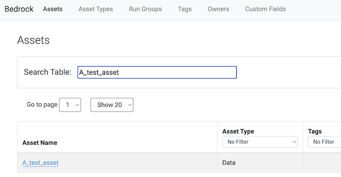
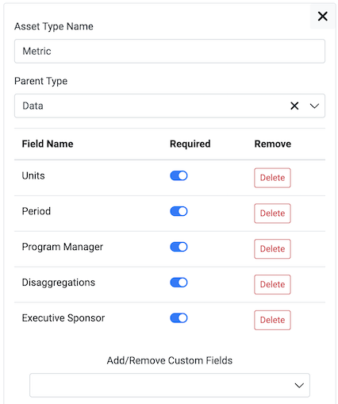
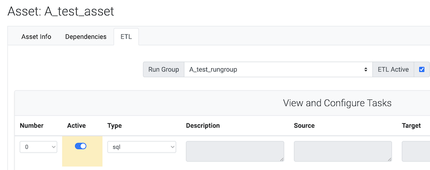
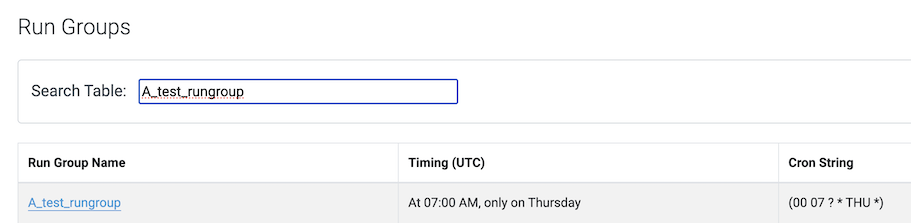
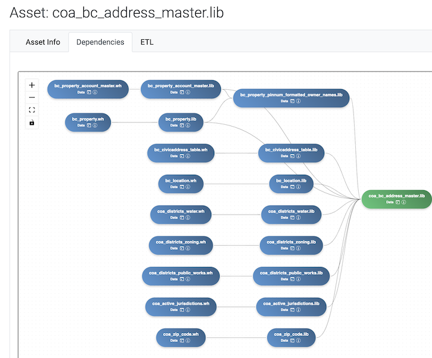

# Creating Assets in the Frontend

When you open the application, you see a list of assets.

Assets are the heart of Bedrock. An asset can be a set of data, such as a database table or a spreadsheet. It could also be any other type of business asset you want to track.
Bedrock includes metadata about each asset. Each asset is given an Asset Type, and each Asset Type can have Custom Fields associated with it. 

Of the Asset Types, the type "Data" is special. That is what is used for ETL jobs. Each Asset with a type Data has Location Information associated with it, which gives all the information needed for the ETL system, such as how to connect to a database.

Asset Types are also hierarchical, so for example under the general Data type, you can have subtypes.

Data Assets can have ETL jobs associated with them.
Instructions for creating ETL tasks: [Using Frontend for Task Configuration](<./docs/Using Frontend for Task Configuration.md>).

ETL jobs can be run on a schedule using Run Groups.

Assets can be set up with Dependencies. For an ETL job that copies from a Google Sheet to a Postgres table, the Sheet is considered a dependency of the Table.

