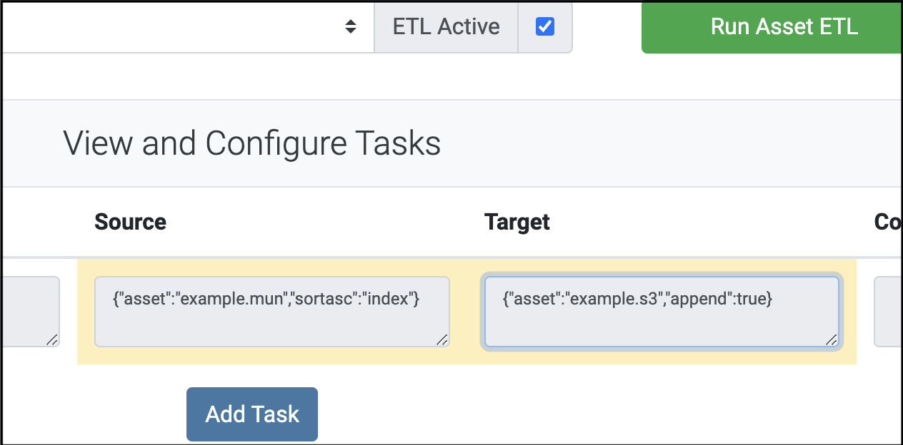

# Configuring ETL tasks in the frontend
Assets can have ETL task associated with them. Each type of task has different configuration parameters in the three fields: Source, Target, and Configuration. Source and Target are formatted as JSON objects, and Configuration is a text field.

## Standard Fields
These options are added to the ETL configuration for an Asset and differ depending of the Task Type:


| Task Type| Source                       | Target                             | Configuration  |
|----------|------------------------------|------------------------------------|--------------- |
|table_copy|{"asset": "source_asset_name"}|{"asset": "target_asset_name"}      |null            |
|file_copy |{"asset": "source_asset_name"}|{"asset": "target_asset_name"}      |null            |
|sql       |null                          |{"connection":"connection_name"}    |SELECT * FROM x;|
|run_lambda|null                          |{"lambda_arn": "arn:aws:lambda:..."}|null            |
|aggregate |{"aggregate": "aggr_name", "data_range": "A3:B", "temp_table": "assetname_temp", "append_tab_name": true, "data_connection": "bedrock-googlesheets"}|{"asset": "maintenance_responsibilities.lib"}|null|


## OPTIONAL fields
These options are appended to the Source and Target fields:

### Table_Copy
#### Database
- SOURCE OPTIONS
  - { "tableheaders": true } Include headers in data: this is mainly used for creating csv files
  - { "sortasc": "fieldname" }
  - { "sortdesc": "fieldname" }
  - { "fixedwidth_noquotes": true } Tables converted to csv by default have strings with double quotes in the data quoted. For fixed width and XML files we don't want that
  - { "crlf": true } Tables converted to csv by default use record delimiters of LF. Set this true to use CRLF.

- TARGET OPTIONS
  - { "append": true } By default, data is overwritten in table. Set to true to append as new rows.    
  - { "append_serial": "fieldname" } Adds an integer auto-numbering key field to target table. A serial field with this name must appear as the last field in the target table.

#### S3 (These are written as CSV files by default)
- SOURCE OPTIONS
  - { "removeheaders": true } skip first row of csv file

#### Google Sheets
- SOURCE OPTIONS
  - { "append_asset_name": true } In the data an extra column is appended to each row with the name of the asset
- TARGET OPTIONS
  - { "append": true } By default, data is overwritten in sheet. Set to true to append as new rows.     


#### File Copy
- OPTIONS Both source and target can have this option

  - { "adjustdate": -1 }

  The option "adjustdate" on a target or source changes the filename created in fillDateTemplate (see below) by that number of days. (-1 means yesterday)

- SOURCE OPTIONS

      { 
            "config": {
                  "sort": "time",
                  "pick": -1,
                  "max_age": 23
            }
      }

  The optional ```config``` member pertains only to an ```sftp``` source connection. For that case, if the ```filename``` parameter is enclosed in forward slashes (```/```), the name is interpreted as a regex expression that any file to be downloaded must match. The ```sort```, ```pick```, and ```max_age``` parameters in ```config``` then select a final single file for download, as follows:
      - if ```max_age``` is greater than 0, it represents a maxiumum allowed age for files in hours (default is 60,000),
      - ```sort``` may be set to ```time``` or ```name``` (default is ```time```) and determines how the resulting list of files is sorted before applying the ```pick``` paramer,
      - ```pick``` can be ```first``` or 0 to pick the first value in the list, ```last``` or -1 to pick the last (default is -1) .

## Other File Types
Bedrock ETL works mainly with CSV files, but other types are supported.
### Table Copy
When copying from a database to S3 files, XML and fixed width files can be created in source databases as views. XML is passed into Bedrock as a one column, one row table, and fixed width appears as one column and multiple rows. Either way you probably want to include the ```{ fixedwidth_noquotes: true }``` flag in the source options. 

### File Copy
Other text file formats and binary files can be copied.

## File Names
- Wherever filenames are used, they can include template strings. This can be useful if you want to write files with unique names based on the date, or for reading files without fixed names.
- When any of the below are found in a filename, they are replaced at runtime with the current date.

      ```
      ${YYYY}
      ${MM}
      ${DD}
      ```
- It is also possible to use the 'adjustdate' option to use yesterday's date, or another number of days away from today. (file_copy only)
- File Copy from FTP can also be selected using RegEx options. See the ```config``` Source options above.