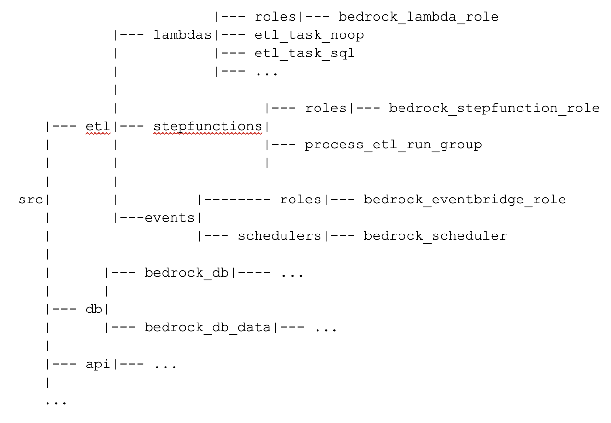

# Deploying a test copy
Included scripts will build a complete copy of Bedrock on AWS, including the network, asset database, roles, Lambdas, and the Step Function.

You will need AdministratorAccess command line permissions to AWS.

Create a file `make_variables` based on `make_variables.sample`. Change INSTANCE to a unique name for your instance, and set the region and account info.

The variable build_mode can be set to "std" if deploying from Linux or "sam" to use a container. This is needed for two Python Lambdas that need Linux native compilation targets for encryption used by the paramiko package.

Everywhere below you can use ```apply-y``` instead of ```apply``` to avoid having to reply 'yes' to each step.

When you are finished with the infrastructure, you can run ```make destroy``` in each directory (in the opposite order from the one you built them in).

### Build everything

#### Network
You may use existing network resources (VPC, subnets, etc.) or build them specially for Bedrock. If you wish to use existing resources, set the values of BEDROCK_VPC_ID, DB_SUBNET_GROUP_NAME, BEDROCK_SECURITY_GROUP_IDS, BEDROCK_PRIVATE_SUBNETS in your `make_variables` file. Otherwise perform the following operations:
```sh
cd src/network
make init
make apply
```
Then copy the values of BEDROCK_VPC_ID, DB_SUBNET_GROUP_NAME, BEDROCK_SECURITY_GROUP_IDS, BEDROCK_PRIVATE_SUBNETS from the output (or the generated file `src/network/bedrock_network_variables.generated`).

#### Database

If you are using an existing database, set the value of ```BEDROCK_DB_HOST``` in src/make_variables to the host name of that database. Otherwise perform the following operations:

```sh
cd ../db
make init
make apply #(Creates database server - takes a while)
make db      #(Creates bedrock database and captures DB endpoint in src/db/make_variables.generated)
make seed    #(Fill database with assets from Github)
# Copy the database host from src/db/make_variables.generated into the value of BEDROCK_DB_HOST
# in src/make_variables (without the port number)
```

#### API and ETL
The remaining infrastructure requires the shared set of Lambda Layers in the `bedrock_common` directory. To build them, perform:

```sh
cd src/bedrock_common
make init
make apply
```

Create the ETL infrastructure.

```sh
cd ../etl
make init
make apply
```

The API depends on the make_variable value STATE_MACHINE_ARN which was exported in the previous step. It can be found in the generated file: `src/etl/state_machine_variables.generated`
Copy that to the make_variables file and then run this to create the API:

``` sh
cd ../api
make init
make apply
```

### To build one Lambda
```sh
# Make sure you create the role needed first
cd src/etl/bedrock-lambda-role
make init
make apply
cd ../etl_task_sql  #(for example)
make init
make apply
```


